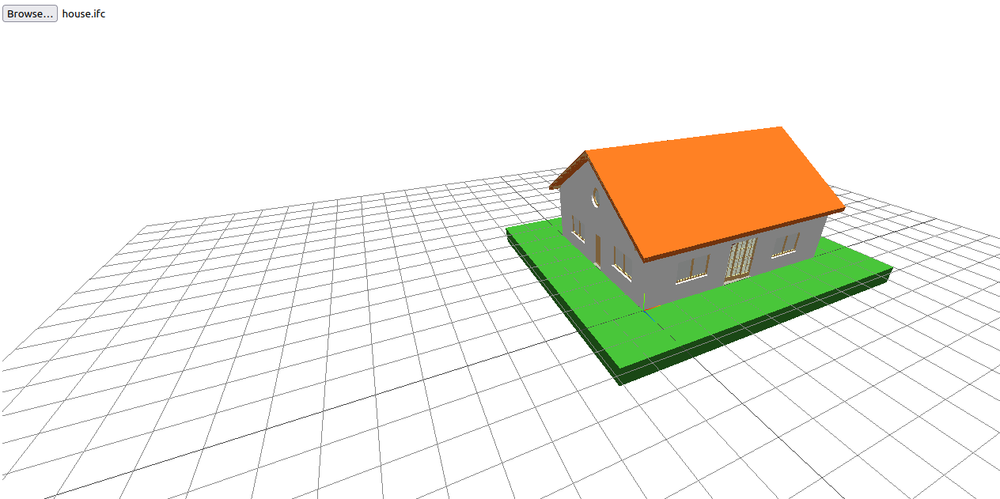

# hello-IFCjs

This is a simple test of how start using [IFCjs](https://github.com/IFCjs)

IFCjs is a javascript library that allow users to view, read and write IFC models on web browsers.

More info on this can be found in [IFCjs docs](https://ifcjs.github.io/info/)

More samples can be found on https://github.com/IFCjs/examples

